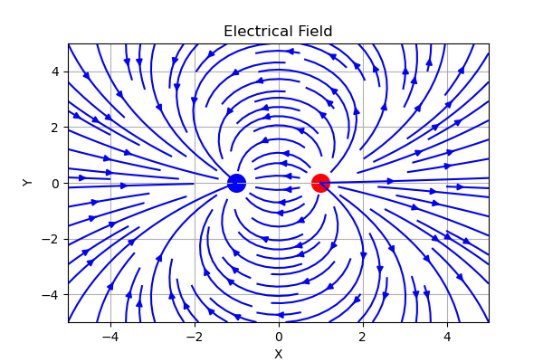
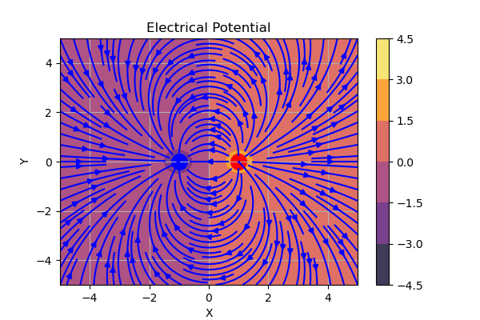
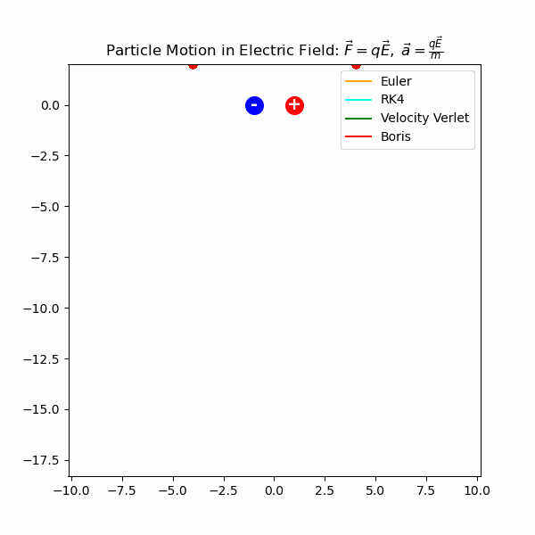

# Electric Field Simulation and Particle Dynamics

This project implements a **numerical simulation of electric fields and charged particle motion** in a two–dimensional space.
The simulation is based on **Coulomb's Law** and particle trajectories are computed using the **Runge–Kutta 4th order (RK4)** numerical integration method.

The code is written in Python and uses **NumPy** for numerical computation and **Matplotlib** for visualization.

---

# Physical Model

We consider a system of point charges located at positions $\mathbf{r}_i = (x_i, y_i)$.

The electric field generated by a single charge is given by Coulomb's law

$$
\mathbf{E}(\mathbf{r}) =
k q \frac{\mathbf{r}-\mathbf{r}_i}{|\mathbf{r}-\mathbf{r}_i|^3}
$$

where

* $q$ is the charge
* $k$ is Coulomb's constant
* $\mathbf{r}$ is the observation point

The total electric field is obtained using the **principle of superposition**

$$
\mathbf{E}_{total} = \sum_i \mathbf{E}_i
$$

To avoid numerical divergence near the charge position, the distance is regularized using

$$
r = \sqrt{dx^2 + dy^2 + \epsilon^2}
$$

where $\epsilon$ is a small smoothing parameter.

---

# Electric Potential

The electric potential of a point charge is

$$
V(\mathbf{r}) = \frac{kq}{r}
$$

The total potential is the sum of potentials from all charges

$$
V_{total} = \sum_i \frac{k q_i}{r_i}
$$

The simulation visualizes the potential as a **filled contour map** together with the electric field lines.

---

# Particle Dynamics

A charged particle moving in an electric field experiences a force

$$
\mathbf{F} = q\mathbf{E}
$$

Assuming unit mass

$$
\mathbf{a} = q\mathbf{E}
$$

The particle state is

$$
(x, y, v_x, v_y)
$$

At each timestep the electric field at the particle position is approximated from the grid.

---

# Numerical Integration (Runge–Kutta 4)

Particle motion is integrated using the **Runge–Kutta 4th order (RK4)** method.

For a system

$$
\frac{d\mathbf{y}}{dt} = f(t,\mathbf{y})
$$

RK4 evaluates four intermediate slopes

$$
k_1 = f(t_n, y_n)
$$

$$
k_2 = f(t_n + \frac{dt}{2}, y_n + \frac{dt}{2}k_1)
$$

$$
k_3 = f(t_n + \frac{dt}{2}, y_n + \frac{dt}{2}k_2)
$$

$$
k_4 = f(t_n + dt, y_n + dt k_3)
$$

The update rule is

$$
y_{n+1} =
y_n + \frac{dt}{6}(k_1 + 2k_2 + 2k_3 + k_4)
$$

RK4 provides significantly better stability and accuracy than first-order methods such as Euler integration, especially in regions with strong field gradients.

---

# Example Charge Configuration

The current simulation uses a **dipole configuration**

* negative charge at $(-1,0)$
* positive charge at $(1,0)$

This configuration produces the classical **electric dipole field pattern**.

---

# Visualization

## Electric Field

Electric field lines are visualized using **streamplots**.

--

## Electric Potential

The electric potential is shown as a **contour map**.

---

## Particle Trajectory

